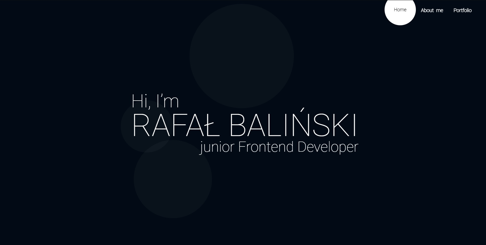

# Strona Portfolio
[link do strony](https://rafalbalinski.github.io/MyPortfolioWebsite/)

## O Projekcie
Projekt ten to w pełni responsywna strona internetowa z moim portfolio. Przy stylizowaniu wykorzystano narzędzie SASS.

## Narzędzia
- HTML5
- CSS3
- JS ES6
- BEM
- Sass
  
